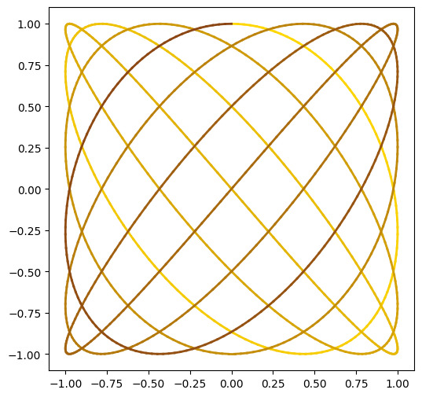

# 作業一

這份作業是針對 Python 程式設計的基礎練習，內容畫函數圖形

- 這個圖形是一條 **李薩如曲線 (Lissajous Curve)**，描述兩個互相垂直的簡諧運動之間的相互關係。
- 線條顏色從金黃色漸變至棕色，搭配圖形看起來變成一塊菠蘿麵包。
- 為了使視覺效果不受干擾，我沒有繪製格線與座標軸。
- 可以透過調整參數來改變函數圖形的顯示：
    1. **頻率比值 $p/q$**：影響曲線的形狀與對稱性
    2. **點的數量**：決定曲線的平滑程度

