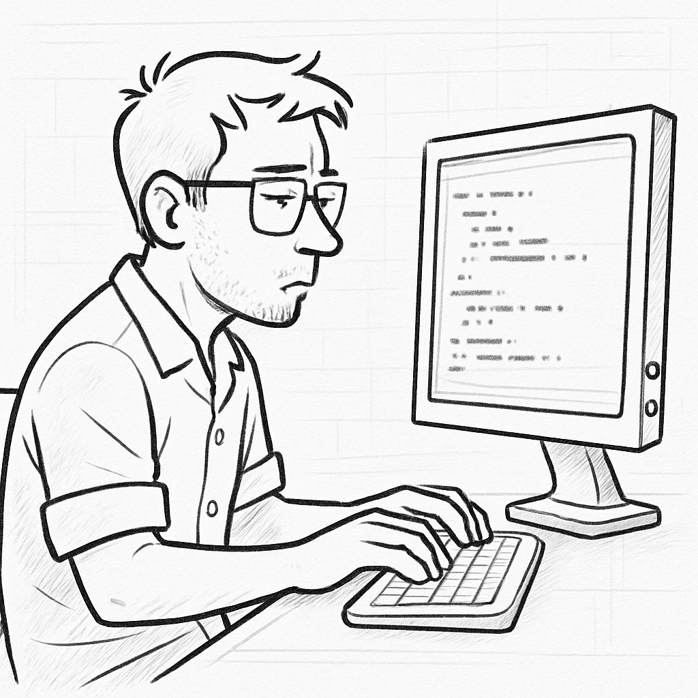
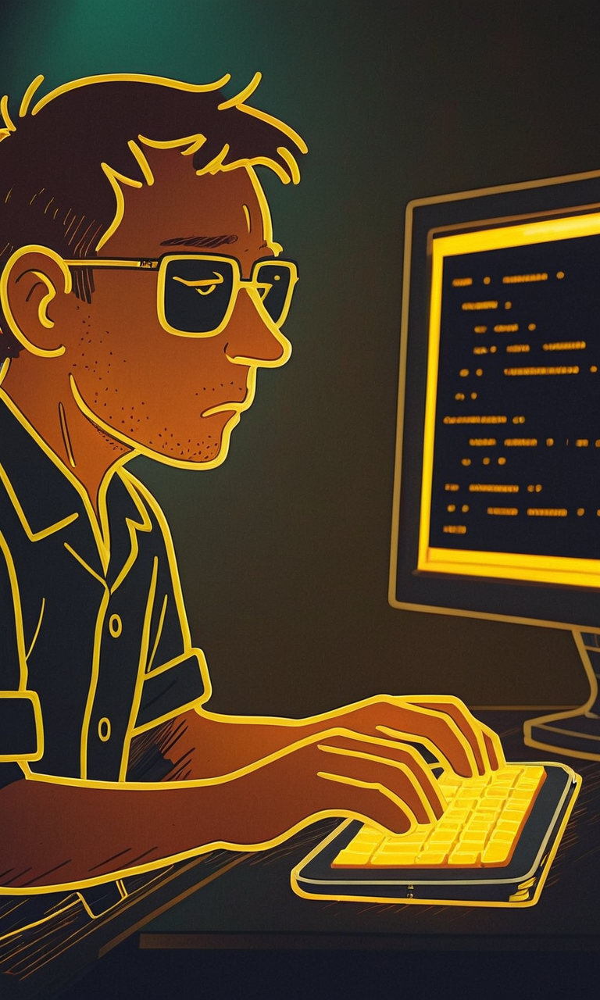
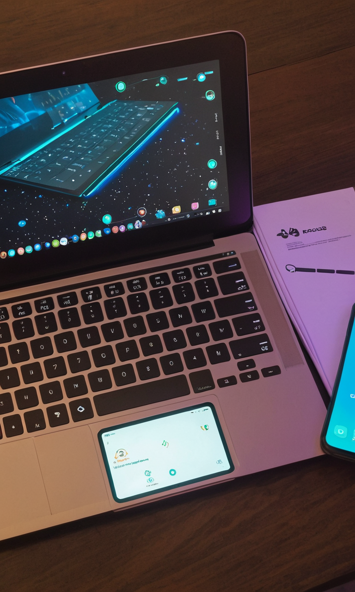
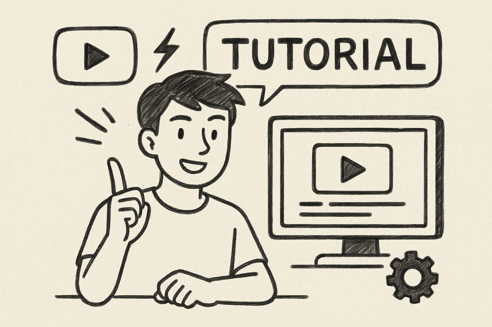
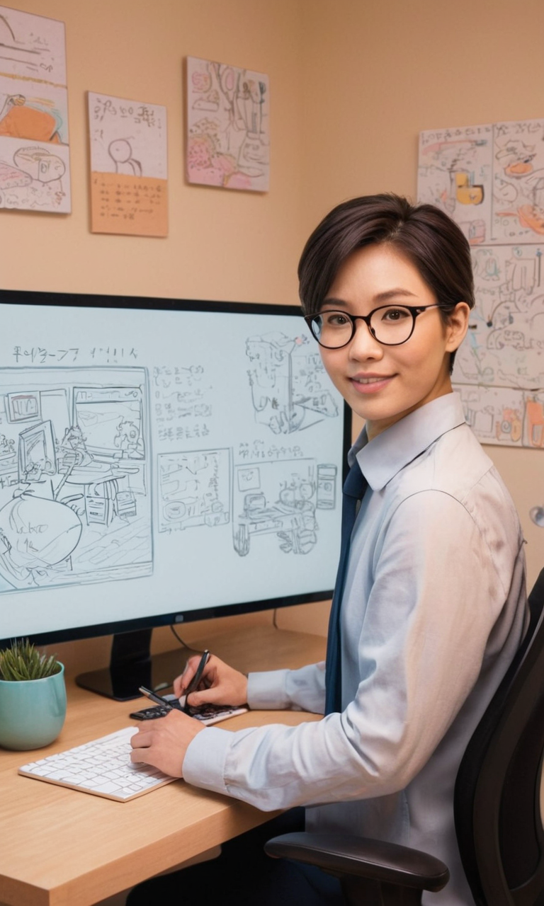

# Fooocus 圖像生成示範專案

> 這份 README 將介紹本專案中三組「Fooocus 生成圖」的成果，以及簡要說明每一組圖像的重點與創作思路。

---

## 一、專案概述

- **目的**  
  本專案透過 GPT4O 先繪製三張黑白線稿（手繪草圖），再使用 Fooocus 將這些線稿轉換成具備特定風格的最終成品。總共分成三組，每一組都包含一張 GPT4O 原始草圖（線稿）與對應的 Fooocus 生成圖（具有顏色、質感與風格細節）。  
- **應用情境**  
  1. **桌面打字場景**：一位程式開發者在電腦前專注 Coding。  
  2. **筆電＋手機俯視場景**：桌面上擺放筆電與手機，凸顯「科技與工作」的氛圍。  
  3. **教學講解場景**：一位講師或 YouTuber 面對電腦螢幕，正在進行教學示範。 
 
- **使用工具**  
  - **GPT4O**：用來繪製初始手繪線稿（黑白輪廓）。  
  - **Fooocus**：透過「Canny 輪廓偵測」與「Inpaint／Style 引擎」，將 GPT4O 線稿轉換成具有漫畫感、寫實感或未來科技感的彩色作品。

---

## 二、檔案目錄結構

```

/
├─ README.md
│
├─ 1\原圖_程式開發者.png            # GPT4o 生成的線稿
├─ 1\Fooocus_程式開發者1.png        # Fooocus 上色結果
├─ 1\Fooocus_程式開發者2.png        # Fooocus 上色結果
│
├─ 2\原圖_筆電與手機.png           # GPT4o 生成的線稿
├─ 2\Fooocus_筆電與手機.png        # Fooocus 上色結果
│
├─ 3\原圖_教學.png                 # GPT4o 生成的線稿
└─ 3\Fooocus_教學.png              # Fooocus 上色結果

````

---

## 三、三組圖像說明

### 1. 組別一：桌面打字的程式開發者

- **1_原圖_程式開發者.png**  
  - 用 GPT4o 畫出一位戴眼鏡的程式開發者坐在電腦前，雙手打字的側面輪廓線稿。  
  - 線條乾淨、有手繪鉛筆質感，保留人物表情（專注／微帶疲憊）、鍵盤與螢幕的大致位置。  

- **1_Fooocus_程式開發者.png**  
  - Prompt 範例：  
    ```
    “Neon outline of a programmer coding at night, cyberpunk vibe, glowing keyboard keys and monitor rim light, bold comic shading, dark background”
    ```  
  - 參數設定：  
    - Resolution：1280×720  
    - Sampling Steps：30  
  - **效果**：以「霓虹線條」突顯鍵盤與螢幕輪廓，主體輪廓呈現強烈黃綠對比，整體氛圍偏向未來科幻 feel。

---

### 2. 組別二：桌面俯視的筆電與手機

- **2_原圖_筆電與手機.png**  
  - GPT4o 線稿：俯視視角，一台筆電打開、旁邊放著手機，底下桌面紋理以簡單斜線標示。  
  - 保留鍵盤鍵位格子、筆電螢幕邊框與手機輪廓。  

- **2_Fooocus_筆電與手機.png**  
  - Prompt 範例：  
    ```
    “Top-down view of a laptop and smartphone on a wooden desk, futuristic UI icons hovering above, subtle manga line ar t, light pastel overlay”
    ```  
  - 參數設定：  
    - Resolution：1920×1080  
    - Sampling Steps：30
  - **效果**：桌面呈現柔和木質紋理、手機螢幕與筆電螢幕自動上色成淺藍色，邊框保留漫畫線條，附近有淡淡的 UI 畫面浮標示意。

---

### 3. 組別三：教學講師／YouTuber 示範場景

- **3_原圖_教學講師.png**  
  - GPT4o 線稿：一位內容創作者面對螢幕、手指指向螢幕中的教學內容，背景牆上簡單畫有筆記與插畫。  
  - 線圖僅以鉛筆描出人物比例、螢幕位置與講師的手勢，簡潔俐落。  

- **3_Fooocus_教學講師.png**  
  - Prompt 範例：  
    ```
    “Friendly tutor pointing at a large monitor, comic‐style lines with realistic face details, YouTube tutorial icon on screen, warm beige tone background”
    ```  
  - 參數設定：  
    - Resolution：1280×720  
    - Sampling Steps：30  
  - **效果**：講師的五官變得圓潤可愛，螢幕上出現明顯的 YouTube 播放按鈕與標題：「TUTORIAL」，整體色調走「米黃色紙本」質感，讓人有在看手繪 Lyric 動畫的感覺。

---

## 四、生成流程與操作說明

以下以組別一（程式開發者）作為示範，說明從「GPT4O 草圖 → Fooocus 生成圖」的完整操作步驟；其他兩組流程完全相同，只是在 Prompt 與遮罩／Inpaint 側重點略有差異。

1. **準備手繪草圖（GPT4o 線稿）**  
   - 在對話中指令 GPT4o：「請畫出一位側臉程式開發者，正在電腦前打字，畫出黑白線稿。」  
   - 取得 GPT4o 輸出的 PNG 線稿檔（例如 `1_原圖_草圖_程式開發者.png`）並下載保存。

2. **打開 Fooocus，套用 Canny 邊緣偵測**  
   - 將 `1_原圖_草圖_程式開發者.png` 上傳至 Fooocus。  
   - 啟用 **Canny** 模塊：自動偵測線稿輪廓，轉成可直接上色的 Mask。  
   - 確認「輪廓線」與「背景遮罩」正確對齊，必要時微調 Mask 範圍。

3. **輸入 Prompt 與設定參數**  
   - 在 Fooocus 文字欄內，輸入第一組風格所需的 Prompt。例如：「Side view of a focused programmer…」  
   - 設置解析度（1280×720）、Sampling Steps、Guidance Scale、Style Strength。  
   - 確保 Style 模板選擇「manga‐realistic」或自行填寫「manga shading + soft lighting」等關鍵詞。

4. **按下「生成」並檢查初版成果**  
   - 生成後仔細檢視：人物輪廓是否變形、背景顏色是否與預期一致、螢幕內容是否閱讀得清楚。  
   - 若初版已符合需求，直接匯出 PNG 命名為 `1_Fooocus_程式開發者_風格A.png`。  
   - 若需要微調，進入第二階段 Inpaint。

5. **Inpaint 區域細節微調**  
   - 針對「螢幕區域」或「鍵盤區域」劃定 Inpaint Mask，避免 AI 重置整張圖。  
   - 修改 Prompt（例如加入「mechanical keyboard details」、「visible code lines on monitor」）並重新生成。  
   - 以此方式優化文字可讀度、鍵盤按鍵細節、桌面光暈等小細節。  
   - 若想嘗試不同風格，可重新撰寫 Prompt（例如「neon outline」），並儲存為 `1_Fooocus_程式開發者_風格B.png`。

6. **重複以上步驟**  
   - 組別二與組別三流程相同，只要更換「草圖檔」與「Prompt 關鍵詞」，即可得到各種不同主題的最終圖。

---

## 五、整體工作流程  

```

GPT4O 線稿 → Fooocus Canny 輪廓偵測 → Prompt＋參數 → Inpaint 微調 → 最終匯出

```


### 圖例預覽

> **組別一：程式開發者**
>
>

> **組別二：筆電與手機**
>
>


> **組別三：教學講師**
>
>