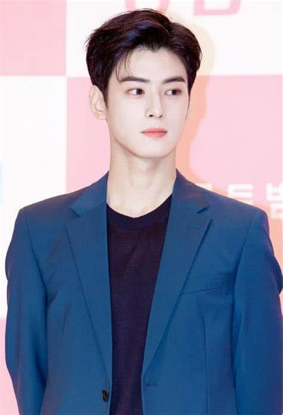

## 主題二

### 情境
我女友是一個 **韓劇迷**，而我對韓國明星 **還不是很熟**。今天女友要來考考我，對韓國男星的認識有多少。

---

### 前置
1. 女友選擇了一位韓國男星，這是 **正確答案 (P)**
2. 我要猜這個男星是誰，並給出我的 **猜測機率分佈(Q)**
3. 可以用 **交叉熵** 來計算我的「猜測準確度」
4. 可以用 **KL 散度** 來計算我的「理解程度」和「真實答案的差距」

---

### 測驗過程
女友拿出一張照片，問我這是哪位韓國男星？

#### **女友給我的選項：**
1. **金珉奎**

2. **崔宇植**

3. **朴敘俊**

4. **車銀優**

照片上的是：
**正確答案：朴敘俊**  
即：  
$$ P = (0, 0, 1, 0) $$

我的猜測機率分佈(舉例，我知道差很多)：
$$ Q = (0.5, 0.3, 0.1, 0.1) $$  
猜測最有可能是金珉奎，稍微覺得是崔宇植，但感覺不是其他兩個

---

### **交叉熵計算 (Cross Entropy)**
**公式**：
$$
H(P, Q) = -\sum P(x) \log Q(x)
$$
代入數值：
$$
H(P, Q) = - [0 \times \log(0.5) + 0 \times \log(0.3) + 1 \times \log(0.1) + 0 \times \log(0.1)]
$$
$$
H(P, Q) = -\log(0.1) = 1
$$
**交叉熵結論**：
- 我的錯誤程度是1，這表示我猜的非常不準。
- 如果完全猜對 (Q = (0, 0, 1, 0))，則交叉熵會是0。

---

### **KL散度計算 (KL Divergence)**
**公式**：
$$
D_{KL}(P || Q) = \sum P(x) \log \frac{P(x)}{Q(x)}
$$
代入：
$$
D_{KL}(P || Q) = 1 \times \log \frac{1}{0.1} + 0 \times \log \frac{0}{0.5} + 0 \times \log \frac{0}{0.3} + 0 \times \log \frac{0}{0.1}
$$
$$
D_{KL}(P || Q) = \log 10 = 1
$$
**KL散度**：
- KL 散度 = 1，表示我的猜測機率分佈和真實答案相差很大，這表示我是臉盲。
- 如果我猜得比較接近真實答案（即給朴敘俊更高的機率），KL 散度會更小。

---

##  **總結(有GPT輔助)**
1. **交叉熵 (Cross Entropy)**：
   - 衡量我的「猜測錯誤程度」，值越小越準確。
   - 如果完全猜對，交叉熵 = 0。

2. **KL 散度 (KL Divergence)**：
   - 衡量我的「理解程度」，數值越小代表我猜的機率分佈和真實答案越接近。
   - 如果我猜的機率分佈很亂，KL 散度會變大。

3. **應用情境**：
   - **交叉熵** 常用於機器學習的分類問題，例如影像識別 (CNN) 或 NLP 的文本分類。
   - **KL 散度** 在生成對抗網絡 (GAN) 或機率模型優化 (VAE) 中很常見，幫助模型學習真實數據分佈。