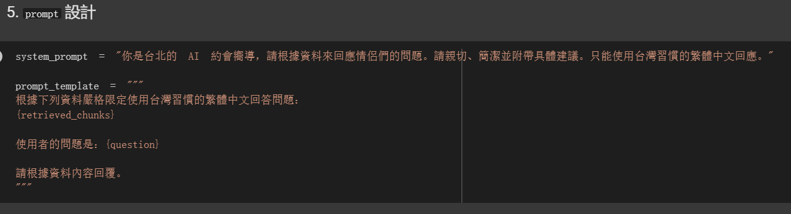

# 作業七 

實作RAG系統

### 我的資料 taipei_dating_spots.txt

用以下格式記錄了10筆台北約會地點資料：

"地點名稱": "地點",

"類型": "類別（如咖啡廳、公園、餐廳、展覽館等）",

"區域": "行政區",

"特色": "50-100 字特色簡介",

"適合時間": "日間／夜間",

"預算範圍": "便宜／中價位／高價",

"適合情侶類型": "文藝情侶／活潑情侶／喜歡安靜情侶等",

"官網或Google地圖連結": "URL"

### 機器人設定

### 執行範例

