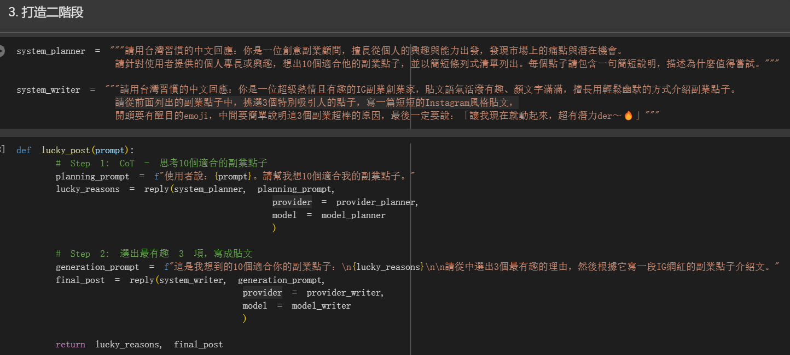
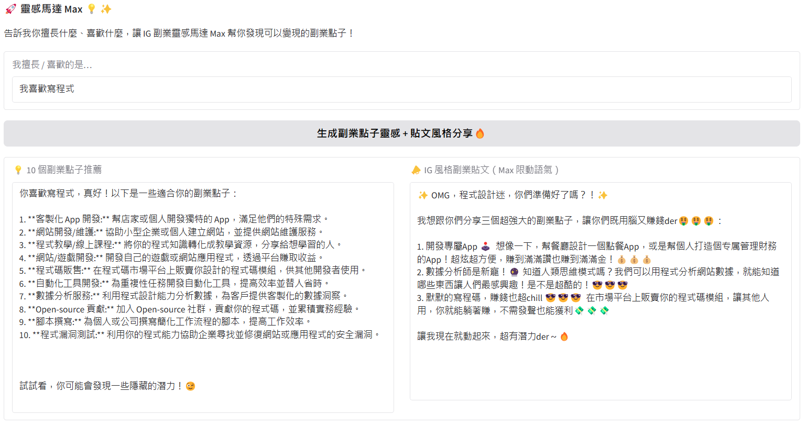
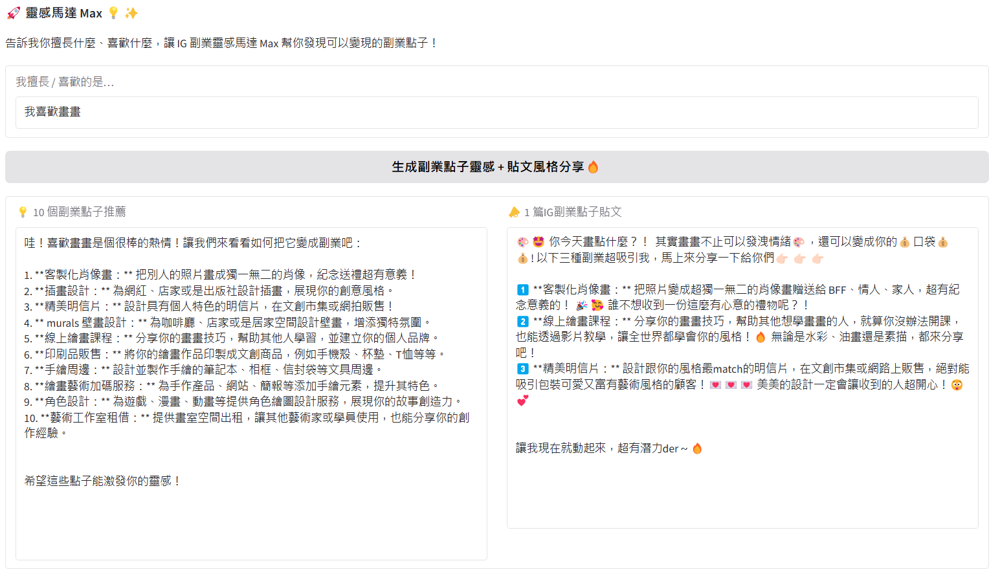
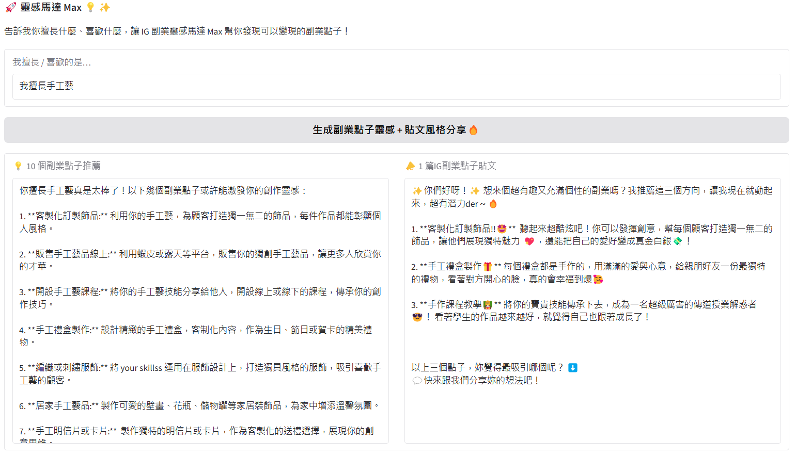

# 作業八｜靈感馬達 Max：打造你專屬的副業點子生成器 💡

這是一個結合 AI Agent 設計與 ChatGPT Chain-of-Thought (CoT) 策略的互動應用。你只需要輸入你喜歡或擅長的事情，系統就能為你量身打造 10 個潛力副業點子，並自動產出一則 IG 風格貼文，幫你幽默又有梗地介紹副業靈感！

## 🌟 專案亮點特色

- 使用 Chain-of-Thought (CoT) 規劃副業點子，提高創意與邏輯性
- 利用兩階段 AI 模型（planner + writer）生成點子 + 社群貼文
- 仿 IG 網紅貼文風格，自動加入 emoji、網路語氣、梗話術
- 超適合用來練習 LLM agent chaining 與 prompt engineering！

## 📦 專案架構與流程

1. **輸入興趣或擅長項目**（如：寫程式、畫畫、手作）
2. **第一階段 AI 規劃器（system_planner）**
   - 根據輸入生成 10 個潛力副業點子，並附上為什麼值得一試的說明
3. **第二階段 IG 寫手 AI（system_writer）**
   - 從中選出 3 個最吸睛的點子，並生成一篇有趣又口語化的 IG 貼文

---

## 🖼 代理人設定截圖

---

## 🔍 實際範例展示

### ✏️ 輸入：「我喜歡寫程式」

### 🎨 輸入：「我喜歡畫畫」

### ✂️ 輸入：「我喜歡手工藝」

---
如果你也喜歡這樣的創意專案，歡迎 ⭐ 收藏，或 fork 自行發揮更多點子吧！
